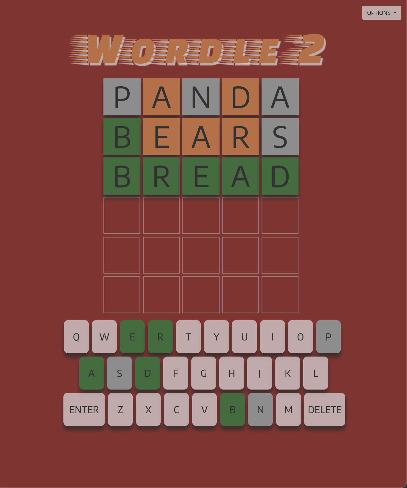
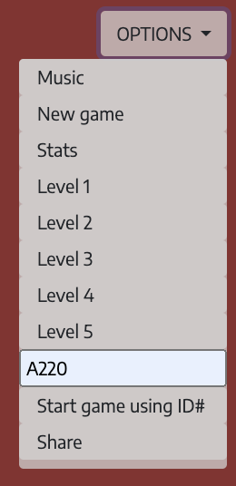
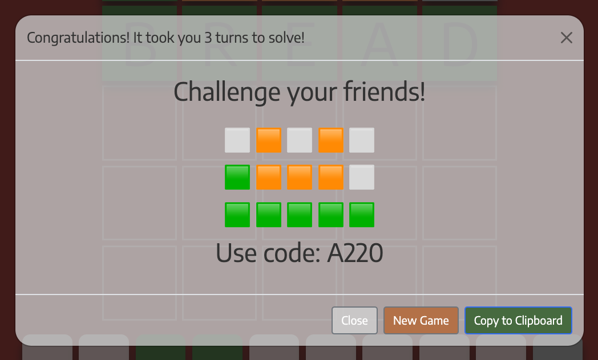
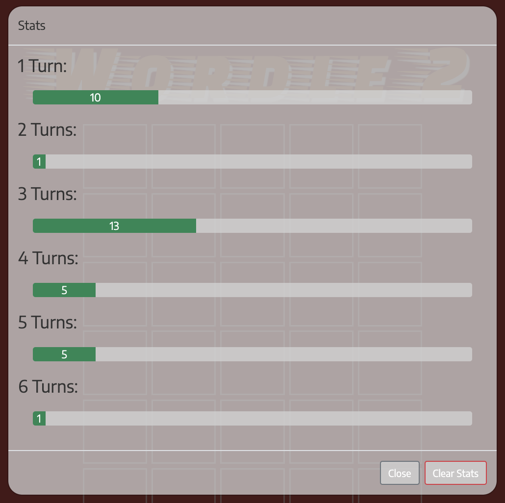

<!-- WORDLE 2 -->

A clone of the hit game Wordle with some minor adjustments

<!-- Getting Started -->

https://maxmay94.github.io/wordle2/

Located in the options menu :
  -> Music : toggle the games music on / off

  -> New Game : Start a new game

  -> Stats : See your stats

  -> Level 1 - 5 : change difficulty level

  -> Search ID# : Type code to play a specific word. These codes can be found at the end of the game in the Share Screen

  -> Start game using ID# 

  -> Share : get the word code and shareable emoji

  <!-- Screenshots -->

  
  
  
  
  

<!-- Technologies Used -->

JavaScript, HTML, CSS

<!-- Next Steps -->

1. Polish things up
2. Optomize Mobile
3. Fix and refine current Audio
4. Add an Audio sequencer based on previous turns (loop through the prevTurns[] and play a nothing on miss, percussive hit on almost and sharp synth lead on correct)

<!-- SOURCES -->

  word-list.js : Ben Manley